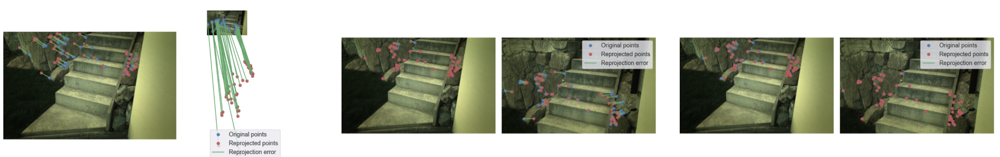

# Structure from Motion (SfM) Project - 3D Vision Project

This is a Python project that implements a simple differentiable SfM pipeline with PyTorch. The pipeline consists of the following steps:

1. Feature extraction and matching between pairs of images
2. Triangulation of 3D points from the matched features
3. Utilize differentiability of the pipeline to optimize certain module



## Formulation

- `\dataset` contains a `sample_data` for testing, and more data can be downloaded from [ETH 3D](https://www.eth3d.net/slam_datasets)
- `\output` as an empty directory to store plots produced by `run_bundle_adjustment_pt.py` and `run_pixel_adjustment_pt.py`
- `\test` contains example code for feature extraction of Kornia
- scripts name as `*_pt.py` are implemented with PyTorch, whereas other are implemented with OpenCV as a baseline

## Installation

To run this project, you will need Python 3 and the following libraries:

- NumPy 1.23.5
- OpenCV 4.6.0
- Matplotlib 3.7.1
- Kornia 0.6.12
- PyTorch 2.0.1
- PyPose 0.4.3

You can install these libraries using pip:

    pip install numpy==1.23.5 opencv-python matplotlib kornia torch==2.0.1 pypose

To utilize `cv2.SIFT_create()` you have to install OpenCV with:

    pip install opencv-contrib-python

## Usage

### Data preparation

Download any monocular version of dataset from [ETH 3D](https://www.eth3d.net/slam_datasets), and place the unzip folder under `\dataset\<dataset_name>`.

### Generate reprojection error plots with multiple runs

To plot how the reprojection error varies with optimization steps for multiple runs:

- Bundle adjustment

  ```
  python run_bundle_adjustment_pt.py sample_data
  ```

- Feature coordinates adjustment
  ```
  python run_pixel_adjustment_pt.py sample_data
  ```

### Triangulated 3D point cloud

To process image sequence and plot all triangulated 3D points:

```
python main_sequence_pt.py sample_data
```

## Customization

You can customize the SfM pipeline by modifying the following:

- Calibration pattern size: you can change the pattern size by modifying the `pattern_size` variable in `calibrator.py`
- Feature extraction method: you can change the feature extraction method by modifying the `method` parameter in `FeatureExtractor` class in `feature_extractor.py`
- Feature matching method: you can change the feature matching method by modifying the `matcher` parameter in `FeatureMatcher` class in `feature_extractor.py`

## Credits

This project was inspired by the following resources:

- [OpenCV SfM module](https://github.com/opencv/opencv/blob/master/samples/python/stereo_match.py)
- [Pytorch](https://pytorch.org/)
- [Exercise SfM pipeline by Hsuan-Hau Liu](https://github.com/hsuanhauliu/structure-from-motion-with-OpenCV)
- [Kornia](https://kornia.readthedocs.io/en/latest/)

## License

This project is licensed under the MIT License. See the `LICENSE` file for details.
